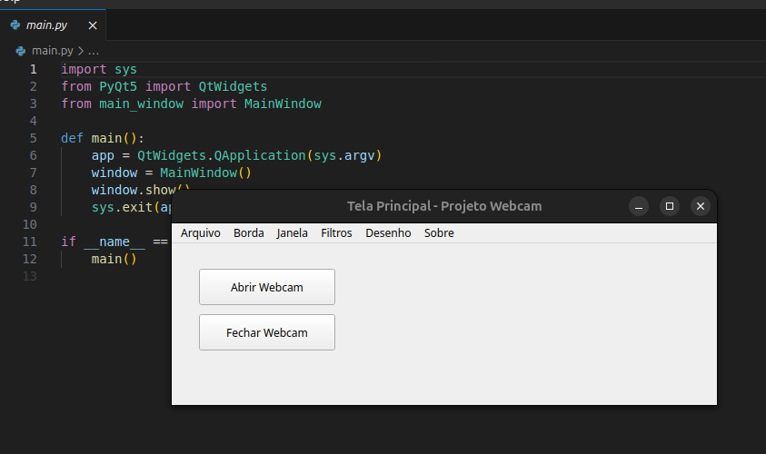
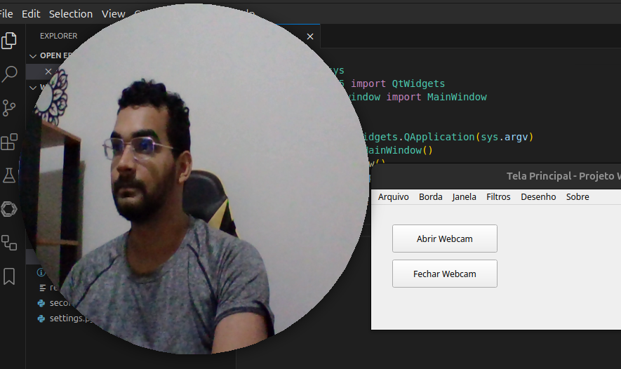
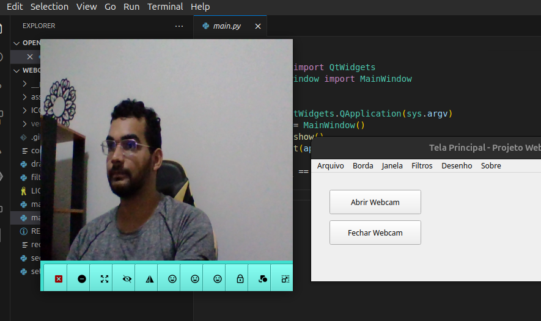
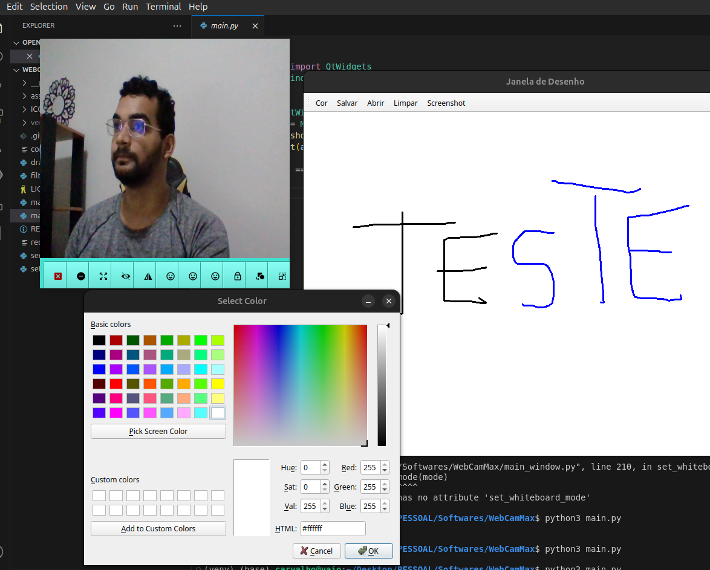

# WebCamMax

WebCamMax é um software de código aberto que visa fornecer um conjunto de ferramentas para auxiliar na gestão de uma webcam para fins de gravação de vídeo. Uma das principais funcionalidades é a possibilidade de TRAVAR A JANELA da webcam, mantendo-a sempre fixa na tela e podendo ser arrastada para qualquer posição. Além disso, o software oferece a possibilidade de mudar o formato da janela da webcam entre CIRCULAR e QUADRADA, aplicar filtros de imagem, desenhar na tela e muito mais.

## Sumário
- [WebCamMax](#webcammax)
  - [Sumário](#sumário)
  - [Pré-requisitos](#pré-requisitos)
  - [Configuração](#configuração)
    - [1. Criação e Ativação de Ambiente Virtual (Venv)](#1-criação-e-ativação-de-ambiente-virtual-venv)
    - [2. Instalação dos Requerimentos](#2-instalação-dos-requerimentos)
      - [Opção 2: Instalar individualmente (RECOMENDADO)](#opção-2-instalar-individualmente-recomendado)
      - [Opção 2: Instalar via  requirements.txt](#opção-2-instalar-via--requirementstxt)
  - [Como Usar](#como-usar)
    - [Executar em um único arquivo](#executar-em-um-único-arquivo)
  - [Screenshots](#screenshots)
  - [Funcionalidades da tela principal](#funcionalidades-da-tela-principal)
  - [Funcionalidades da Tela de WebCam](#funcionalidades-da-tela-de-webcam)
  - [Estrutura de Pastas](#estrutura-de-pastas)
  - [Contribuindo](#contribuindo)
  - [Requisitos](#requisitos)
  - [Licença](#licença)
  - [Correção de Bugs](#correção-de-bugs)
    - [GNU/Linux - Plugin XCB](#gnulinux---plugin-xcb)

## Pré-requisitos

- Python 3.x
- PyQt5
- OpenCV

## Configuração

### 1. Criação e Ativação de Ambiente Virtual (Venv)

É fortemente recomendado criar e ativar um ambiente virtual para evitar conflitos de dependências com outros projetos. No terminal ou prompt de comando, execute:

```bash
# Crie o ambiente virtual
python3 -m venv venv

# Ative o ambiente virtual (Linux/macOS)
source venv/bin/activate

# Ative o ambiente virtual (Windows)
venv\Scripts\activate
```

### 2. Instalação dos Requerimentos

#### Opção 2: Instalar individualmente (RECOMENDADO)
Para instalar cada biblioteca de forma manual, execute no terminal (já com o ambiente virtual ativado):

```bash
pip install PyQt5==5.15.11
pip install opencv-python==4.11.0.86
pip install opencv-python-headless==4.11.0.86
python3 main.py 
```

#### Opção 2: Instalar via  requirements.txt

Se preferir instalar todos os pacotes de uma vez, utilize:
```bash
pip install -r requirements.txt
python3 main.py
```

## Como Usar

### Executar em um único arquivo

Para iniciar o projeto, execute o script principal:

```bash
python main.py
```

## Screenshots
|Tela Princial|WebCam Circular|
|---|---|
|||
|WebCam Quadrada com Menu|Janela de Desenho|
|||

## Funcionalidades da tela principal

O arquivo `main_window.py` contém as seguintes funcionalidades:

- **Abrir Webcam**: Botão que lança a Tela Secundária (SecondWindow).
- **Fechar Webcam**: Botão que fecha a Tela Secundária.
- **Salvar Configurações**: Menu para salvar as configurações atuais.
- **Carregar Configurações**: Menu para carregar configurações previamente salvas.
- **Aplicar Filtro Sobel**: Menu para aplicar o filtro Sobel.
- **Aplicar Filtro Gaussian**: Menu para aplicar o filtro Gaussian.
- **Aplicar Filtro Salt & Pepper**: Menu para aplicar o filtro Salt & Pepper.
- **Aplicar Filtro Gray**: Menu para aplicar o filtro Gray.
- **Resetar Filtros**: Menu para resetar os filtros aplicados.
- **Borda Circular**: Menu para definir a borda da captura como circular.
- **Borda Quadrada**: Menu para definir a borda da captura como quadrada.
- **Travar Janela**: Menu para travar a posição da janela.
- **Destravar Janela**: Menu para destravar a posição da janela.
- **Abrir Desenho**: Menu para ativar o modo de desenho na tela.
- **Sair do Desenho**: Menu para desativar o modo de desenho na tela.
- **Sobre este projeto**: Menu para exibir informações sobre o projeto.


## Funcionalidades da Tela de WebCam

A `SecondWindow` oferece diversas funcionalidades acessíveis através da barra de ferramentas (`toolBarLayout`):

1. **Fechar**: Botão para fechar a janela.
2. **Minimizar**: Botão para minimizar a janela.
3. **Maximizar/Restaurar**: Botão para maximizar ou restaurar o tamanho da janela.
4. **Ocultar Barra**: Botão para ocultar a barra de ferramentas (atalhos: Ctrl+N para ocultar, Ctrl+M para mostrar).
5. **Flip Horizontal**: Botão para inverter horizontalmente a imagem da webcam.
6. **Placeholder 1**: Espaço reservado para futuras funcionalidades.
7. **Placeholder 2**: Espaço reservado para futuras funcionalidades.
8. **Placeholder 3**: Espaço reservado para futuras funcionalidades.
9. **Travar/Destravar**: Botão para travar ou destravar a janela, mantendo-a sempre no topo.
10. **Botão mudar Círculo/Quadrado**: Botão para alternar entre os formatos de janela circular e quadrada.
11. **Redimensionar**: Botão para redimensionar a janela arrastando o botão.
12. **Atalhos (ocultar/mostrar barra)**: Atalhos para ocultar (Ctrl+N) e mostrar (Ctrl+M) a barra de ferramentas.
## Estrutura de Pastas

A estrutura típica do projeto é:

```
projeto-webcam/
├── ICONS/

├── filters.py
├── drawing_window.py
├── second_window.py
├── settings.py
├── main_window.py
├── main.py

├── config.mcam

├── requirements.txt

├── README.md
├── LICENSE
```

## Contribuindo

Contribuições são bem-vindas! Para propor melhorias, correções ou novas funcionalidades:

1. Faça um fork deste repositório.
2. Crie uma nova branch: `git checkout -b minha-nova-feature`.
3. Faça commit das suas alterações: `git commit -m 'Adicionando nova feature'`.
4. Faça push para a branch: `git push origin minha-nova-feature`.
5. Abra um Pull Request descrevendo suas alterações.

## Requisitos

- Python 3.x
- PyQt5
- OpenCV

## Licença

Este projeto está licenciado sob a licença MIT. Veja o arquivo [LICENSE](LICENSE) para mais detalhes.

## Correção de Bugs
### GNU/Linux - Plugin XCB
Se aparecer o erro abaixo, execute o comando abaixo para corrigir o problema:

ERROR:
```bash
  QObject::moveToThread: Current thread (0x3ce0bd50) is not the object's thread (0x3d356b60).
  Cannot move to target thread (0x3ce0bd50)
  qt.qpa.plugin: Could not load the Qt platform plugin "xcb" in "~/WebCamMax/venv/lib/python3.12/site-packages/cv2/qt/plugins" even though it was found.
  This application failed to start because no Qt platform plugin could be initialized. Reinstalling the application may fix this problem.
  Available platform plugins are: xcb, linuxfb, minimal, offscreen, vnc, webgl.
  Aborted (core dumped)
```

CORREÇÃO:
```bash
### DESINSTALAR AS BIBLIOTECAS DO requirements.txt
  pip uninstall -r requirements.txt -y

### INSTALAR MANUALMENTE
  pip install PyQt5==5.15.11
  pip install opencv-python==4.11.0.86
  pip install opencv-python-headless==4.11.0.86
  python3 main.py 
```
